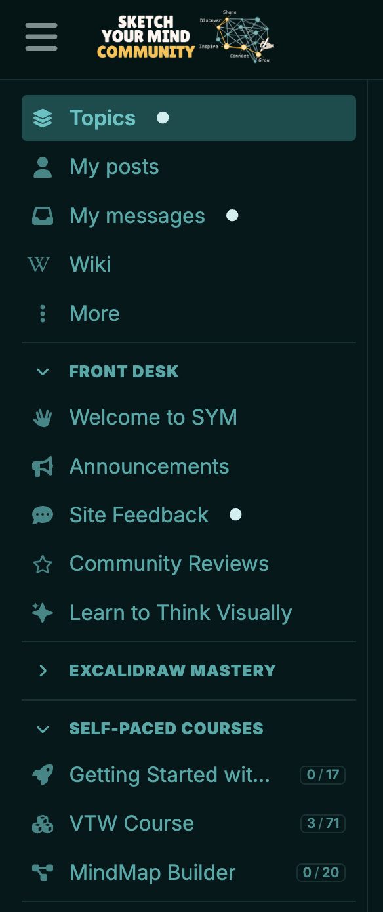
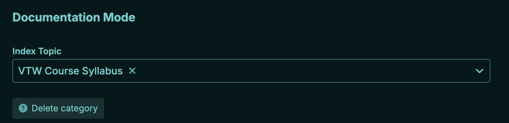
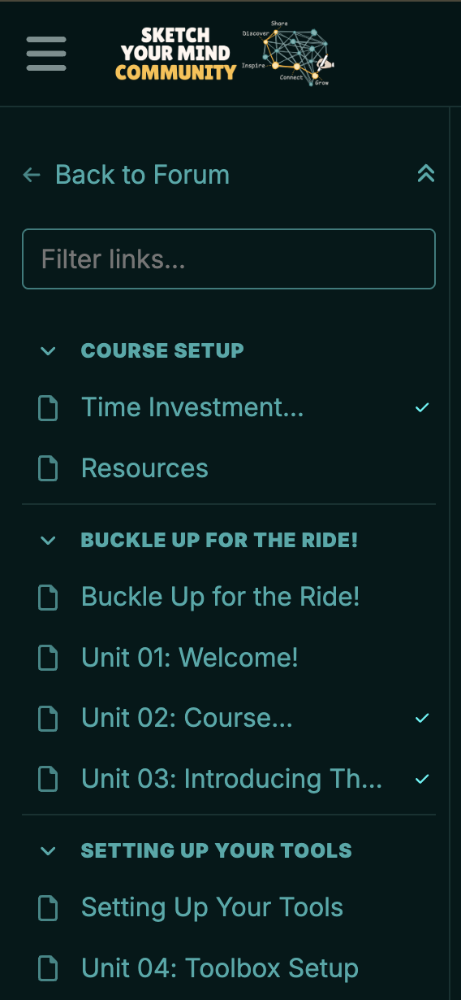

# Discourse Course Progress Theme Component

A frontend UI component that adds native-looking course progression badges `[ 3 / 69 ]` to your Discourse sidebar, and green checkmarks next to completed lessons inside your Discourse Docs outlines.

## ⚠️ Required Dependency
**This Theme Component will not do anything on its own.** It requires the backend API provided by the [Discourse Course Progress Plugin](https://github.com/zsviczian/discourse-course-progress). You MUST install the backend plugin via your `app.yml` before installing this theme component.

## Screenshots

**1. Main Sidebar Progress Badges**
Replaces standard notification dots with mathematical progress indicators for any category configured as a Course.

**2. Lesson Completion Checkmarks**
Injects success checkmarks (`fa-check`) inside the Docs sidebar outline when a user finishes reading a topic.

**3. How to Trigger (Category Settings)**
The UI will automatically activate for any category that has an Index Topic configured in its Docs settings. 

## Installation

Unlike backend plugins, this Theme Component is installed directly through your web browser via the Discourse Admin Panel. No server rebuilds are required!

1. Go to your Discourse site.
2. Navigate to **Admin -> Customize -> Themes**.
3. Click the **Install** button.
4. Select **From a git repository**.
5. Paste the URL of this repository: `https://github.com/zsviczian/discourse-course-progress-theme`
6. Click Install.
7. Add this component to your active Main Theme(s).

## Features & Styling
* Seamlessly fetches historical read data from your custom backend API.
* Uses native Discourse CSS classes (`fa-check`, `--success` colors) to perfectly match your site's active color palette (Light/Dark modes).
* Respects standard Discourse flexbox layouts and long-text truncation so your sidebar never breaks on small screens.